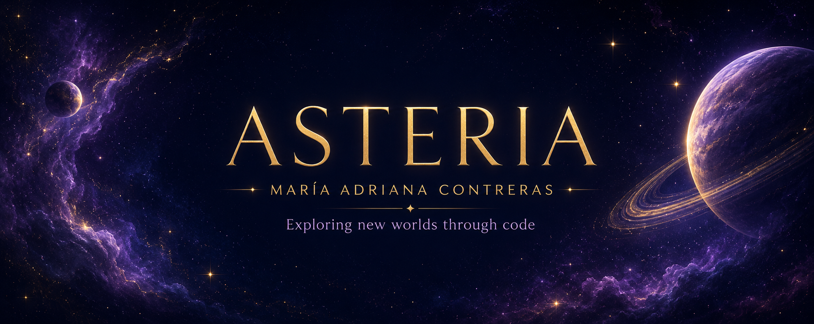

  

---

## 🌙 Astronaut Log

Soy **desarrolladora Java Full Stack en formación**, con experiencia en el área clínica, comunicación y análisis de información.

Actualmente estoy fortaleciendo mis conocimientos en desarrollo web, programación y metodologías ágiles para crear soluciones funcionales, accesibles y visualmente atractivas.

- 🔭 Trabajando en **Project Asteria**
- 🚀 Formándome en **Generation México**
- 🌱 Aprendiendo **Java, Spring Boot, SQL y JavaScript**
- 🪐 Interesada en **Scrum y Product Management**
- ✨ Combinando creatividad, tecnología y experiencia de usuario
- 📍 México

---

## 🪐 Technology System

---

## ⭐ Project Constellation

### 🌌 Project Asteria

Portafolio web inspirado en el espacio, diseñado para presentar mis proyectos, habilidades y trayectoria profesional mediante una experiencia interactiva.

`HTML` · `CSS` · `JavaScript` · `GitHub Pages`

### 🐾 Marcando Huellitas

E-commerce de productos para mascotas con un módulo especializado en donaciones transparentes para refugios de rescate animal.

`HTML` · `CSS` · `JavaScript` · `Bootstrap` · `Git`

### 📊 Data Analytics Project

Proyecto colaborativo de análisis y visualización de datos desarrollado con Python y Google Colab.

`Python` · `Google Colab` · `Data Analysis`

---

## 📡 GitHub Transmission

### ✦ ASTERIA CONTROL PANEL ✦

| 🛰️ Transmission | 🌌 Status |
|:---|:---|
| **Profile** | `piripili` |
| **Main Mission** | `Java Full Stack Development` |
| **Current Project** | `Project Asteria` |
| **Technologies** | `Java · HTML · CSS · JavaScript` |
| **Formation** | `Generation México` |
| **Connection** | `ONLINE` 🟢 |

 

